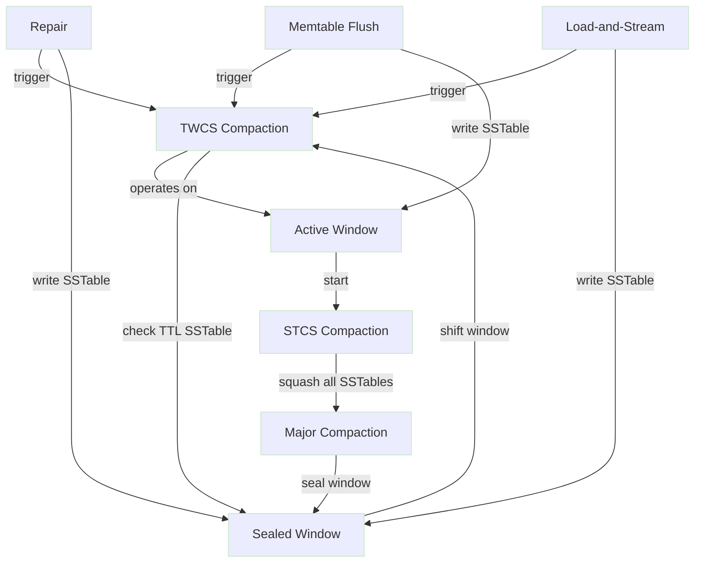

```mermaid
flowchart TD
    A["Memtable Flush"] -- trigger --> B["TWCS Compaction"]
    A -- write SSTable --> C["Active Window"]
    D["Repair"] -- trigger --> B
    D -- write SSTable --> E["Sealed Window"]
    F["Load-and-Stream"] -- trigger --> B
    F -- write SSTable --> E
    B -- operates on --> C
    B -- check TTL SSTable --> E
    C -- start --> G["STCS Compaction"]
    G -- squash all SSTables --> H["Major Compaction"]
    H -- seal window --> E
    E -- shift window --> B

    style A stroke:#C8E6C9
    style B stroke:#C8E6C9
    style C stroke:#C8E6C9
    style D stroke:#C8E6C9
    style E stroke:#C8E6C9
    style F stroke:#C8E6C9
    style G stroke:#C8E6C9
    style H stroke:#C8E6C9
```
